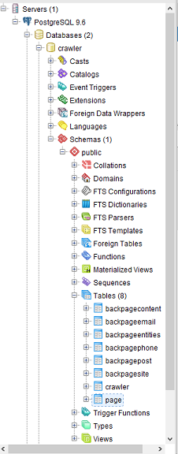
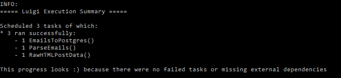

# Human Trafficking ETL
[](https://travis-ci.org/anidata/ht-etl) [](https://coveralls.io/github/anidata/ht-etl?branch=master)

This project will hold all the ETL code required to transform the raw HTML
web pages into clean, normalized data that can be used for analysis.

## Getting started
You will need the following installed:

* Python 2.7.x (where `x` means any number) [download here](https://www.python.org/downloads)
    * Alternative: make a Python 2.7 environment with Anaconda - see example below.

Then click on the 'Fork' button above to make your own copy of the project,
so that you run

```
git clone https://gitlab.com/yourUsername/ht-etl.git
```

where `yourUsername` is your actual user name (e.g. for Bryant Menn it would
be `bmenn`, yours may vary). The SSH protocol currently does *NOT* work with
`git lfs` with these instructions.

Do *NOT* run the following:

```
git clone https://gitlab.com/anidata/ht-etl.git
```

We are going to use what is called a fork-merge model for git.

### Getting the raw data
A sample of the raw can be accessing by using the `lfs` plugin for `git`.
Instructions to install the `lfs` plugin can be found
[here](https://git-lfs.github.com/).

After installing the `lfs` plugin, setup the plugin by running

```
git lfs install
```

and get the file with

```
git lfs fetch
```

## Module Installation

```
pip install -e .
```
* Alternative: see instructions below for Windows 10 and Anaconda.

### Hacking

Pick an issue off the issue list and get started! If you need help just ping
the `anidata1_1` slack channel for help.

When you're done hacking, run

```
git add .
git commit -m "An explanation of what you did goes here"
git push origin
```

And then open a merge request and make sure it's mentioned in the issue's
comments.


## Running ETL

ETL batch uses Luigi (http://luigi.readthedocs.io/en/stable/index.html) under the hood.

To configure Luigi, rename `luigi.cfg.example` to `luigi.cfg` and add the password to that file.

To run all the jobs excute:

```
luigi --module htetl.main_jobs LoadEntityIds --local-scheduler
```
* Alternative: see instructions below for running email parser with Windows 10 and Anaconda.

## Example: Getting ht-etl email parser to run on Windows 10 using Anaconda from scratch

*Example is for running on local machine instead of Docker if you have trouble getting Docker to work*

### Install ht-etl

* [Install Anaconda](https://www.continuum.io/downloads)
* In Anaconda Navigator ([help](https://docs.continuum.io/anaconda/navigator/getting-started.html))
    * Make & activate a Python 2.7 virtual environment, call it something like ```python_27```
    * Open terminal - the path on the left should end in your environment name like ```python_27```
      and ```python --version``` should say it's 2.7.
    * ```pip install -e C:\\your\\path\\to\\ht-etl```

### Create PostgreSQL database running on your local machine (i.e. not in a Docker container)

* Download and unzip ```crawler_er.tar.gz``` from (https://github.com/anidata/ht-archive)
    * To unzip, first install [7-Zip](http://www.7-zip.org/), then right-click on the file and select 7-Zip.
    * You have to first unzip the .gz, then the .tar.
    * Result should be a ```crawler.sql``` file.
* [Install PostgreSQL](https://www.postgresql.org/download/)
    * **Save the password it makes you enter during installation process! We'll call this ```your_password``` below**
* In pgAdmin
    * Servers -> PostgreSQL 9.6 (top left in PGAdmin window)
    * Password: ```your_password```
    * PostgreSQL 9.6 -> Databases -> Create -> Database, call it "crawler"
* Open psql shell (it's under Windows Start menu -> PostgreSQL 9.6 -> SQL Shell (psql))
* In psql shell
    * Server = ```localhost```
    * Database = ```crawler``` (NOT postgres)
    * Port = ```5432``` (Default Postgres port is 5432 - you can see the server's port in pgAdmin)
    * Username = ```postgres```
    * Password=```your_password```
    * Prompt should now be ```crawler=#```
    * ```CREATE ROLE dbadmin WITH SUPERUSER LOGIN PASSWORD '1234';```
    * ```\i 'C:/your/path/to/crawler.sql';```
    * in pgAdmin you should see some tables as below

    

### Run Luigi tasks

* In a Python 2.7 terminal (open it from Anaconda Navigator as described above)
    * ```cd C:\your\path\to\ht-etl``` (otherwise it errors when it can't find things like ```data/flat_post.csv```)
* ```luigi --module htetl.main_jobs EmailsToPostgres --host localhost --database crawler --user postgres --password your_password --local-scheduler```
* If it worked, it should say something like this at the end

    

* You should see two new files in your ```ht-etl/data``` folder: ```flat_post.csv``` and ```parsed_email.csv```
* You should see two new tables in the crawler database (in pgAdmin, right-click the server icon & "Refresh"): ```emailaddress``` and ```table_updates```

*A strange error I encountered sometimes was "ValueError: need more than 1 value to unpack", originating in ```lock.py```.
 I don't know why, but fixed it by deleting luigi's .pid files in ```C:\Users\Lukas\AppData\Local\Temp\luigi```*


### What just happened? (step-by-step for Luigi newbies)

* See also [Luigi documentation](https://luigi.readthedocs.io/en/stable/)
    Follow along in [main_jobs.py](htetl/main_jobs.py),  [get_data.py](htetl/get_data.py) and [util.py](htetl/util.py))
* First, **EmailsToPostgres** is PENDING, but before it can run it requires **ParseEmails** to run and produce output.
    * Your database parameters (host, database, user, password) were passed into **EmailsToPostgres** via **luigi.Parameter** in its superclass **LoadPostgres**.
      From there they are passed to subsequent classes, as you can see in the code.
* Now **ParseEmails** is PENDING, but before it can run it requires **RawHTMLPostData** to run and produce output.
* **RawHTMLPostData** (which inherits from **QueryPostgres**) requires nothing (no ```requires()``` method), so it runs (its ```run()``` method).
    It gets some columns from the database and makes the 1st CSV, as defined by its ```output()``` method.
* Now **RawHTMLPostData** is DONE, satisfying the requirement (i.e. the output file exists). Luigi can now run **ParseEmails**.
* **ParseEmails** loads the 1st CSV (via **[self.input()](http://luigi.readthedocs.io/en/stable/tasks.html#task-input)**), parses out some email addresses and saves it in the 2nd CSV through its ```run()``` method.
* Now **ParseEmails** is DONE, satisfying the requirement (the output file exists). Luigi can now run **EmailsToPostgres**.
* **EmailsToPostgres** inherits from **LoadPostgres**, which inherits from Luigi's helper class **[luigi.postgres.CopyToTable](http://luigi.readthedocs.io/en/stable/api/luigi.contrib.postgres.html#luigi.contrib.postgres.CopyToTable)**.
    * NB: that documentation is for Luigi 2.6 which moved it to ```luigi.contrib.postgres``` but I expect it works similarly.
* **luigi.postgres.CopyToTable** invokes ```run()```, which eventually calls ```rows()``` in **LoadPostgres** which loads the 2nd CSV file (via **[self.input()](http://luigi.readthedocs.io/en/stable/tasks.html#task-input)**)
    and returns the appropriate generator (yielding a tuple for each row).
 * **luigi.postgres.CopyToTable** now writes each row into the Postgres database **crawler**. It knows which table, columns and datatypes to write
     because of ```table``` and ```columns``` variables in **EmailsToPostgres**.
 * The "output" of **EmailsToPostgres** is not a file but a PostgresTarget representing the inserted dataset (it keeps track using the Postgres table ```table_updates```)

### What if I want to re-run the pipeline to make a new set of output files and new Postgres table?

* Luigi tasks won't execute a second time if the output target already exists. Therefore, you must manually delete the .csv files.
* To re-run the last task, **EmailsToPostgres**, you should manually delete the Postgres tables ```emailaddress``` and ```table_updates```
    * See comment in [main_jobs.py](htetl/main_jobs.py) for why ```table_updates``` has to be deleted too.
* Once the files & tables are deleted you can re-run all 3 tasks using the same luigi command.
* If you only want to run **ParseEmails** and **EmailsToPostgres** you just have to delete the CSV file and database tables
  created by those tasks. You can leave alone the CSV made by **RawHTMLPostData**. This prevents having to re-run time-consuming steps.
* If you only want to run **ParseEmails** but not **EmailsToPostgres** (remember **RawHTMLPostData** will run first if its output does not exist):
    ```luigi --module htetl.main_jobs ParseEmails --host localhost --database crawler --user postgres --password your_password --local-scheduler```
